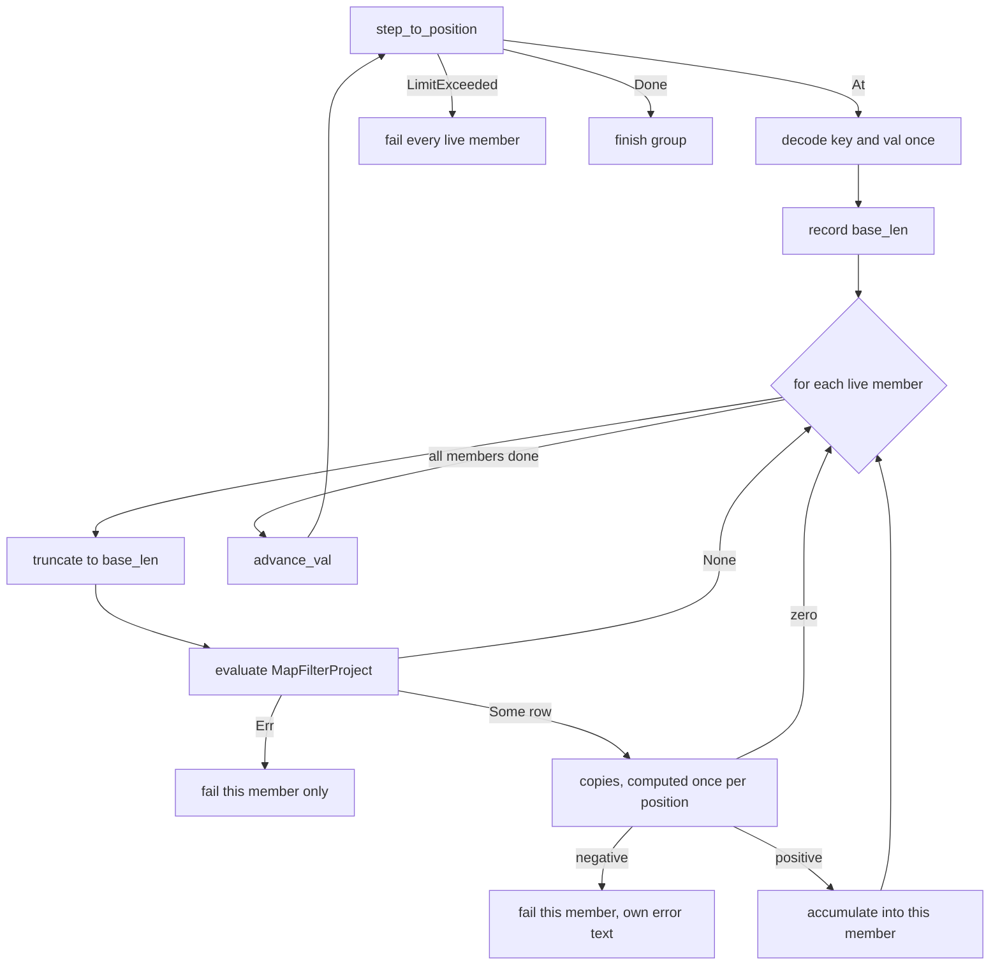

# Index peek coalescing

* Supersedes: https://github.com/MaterializeInc/materialize/pull/37731, which
  targets the pre-offload compute code and is now draft. Its branch is
  `mh/peek-coalescing`. This design is built on `mh/peek-coalescing-v2`.
* Related: https://github.com/MaterializeInc/materialize/pull/38449, the peek
  execution design this one builds on, still open at the time of writing.

## The problem

Every fast-path index peek walks the arrangement that answers it on its own.
When several peeks read the same index at the same timestamp, each one opens its
own cursor, steps every position, and decodes every key and value again. The
work grows linearly in the number of concurrent peeks even though the arrangement
and the timestamp they read are identical. A replica serving a burst of full-scan
peeks therefore spends most of a worker repeating decode work rather than
answering more peeks.

Measurements on `main` put a number on the repetition. With peek offload
disabled, as it then was by default, a full scan whose filter rejects every row
saturates a single timely worker at 36.8 peeks per second, with the walk
accounting for the whole of the bottleneck: 1136 walks at
26.8 ms each fill 30.5 seconds of a 30 second window. The decode and cursor work
that all concurrent peeks would share is around 60% of that walk. The remaining
40% is each peek's own `MapFilterProject`, which no amount of sharing can
amortize.

## Success criteria

A solution succeeds when concurrent index peeks that read one index at one
timestamp pay the cursor and decode cost once rather than once per peek. The
throughput of a walk-bound peek workload should rise by a factor approaching
`1 + D/M`, where `D` is the per-position cost that can be shared and `M` is the
per-position cost of one peek's `MapFilterProject`. Measured on two filter
shapes, that ceiling is 2.4x to 2.6x. The one in-scope workload whose group size
was measured reached 97% of its own ceiling at a group of 55, by
`speedup(N) = N / ((1 - M) + N * M)`, and no group size has been measured for an
in-scope workload at lower concurrency. Peek results must be byte-identical to
what the single-peek path produces, including which errors surface and which
peek sees them.

The change must not regress workloads it cannot help. Peeks that are not walk
bound, that carry literal constraints, or that produce results large enough to
reach the peek response stash must keep their current behaviour and their current
cost. A worker activation must not become longer because peeks were grouped.

## Out of scope

Peeks with literal constraints are excluded. They seek rather than scan, and the
measurements show nothing to win: a 200 row indexed scan runs at 1847 peeks per
second with the worker only 19% busy, so removing the entire walk would not move
the bottleneck. Supporting them would require a union merge-seek over the members'
literal sets and per-member multiplicity bookkeeping, which is a large part of the
design for none of the benefit.

Peeks whose results reach the peek response stash are excluded from the shared
walk. A peek returning 2.4 MB spent 1.1% of its end-to-end latency in the walk
and 85% waiting for an offload permit, so sharing its walk was worth roughly
1.1x. That measurement used a permit fraction of 1.0, and the default is now 4.0,
so permit waiting is a smaller share today and the walk a larger one. The
exclusion does not rest on the permit share alone: each member's persist upload
is its own and cannot be shared, and supporting such members would put that
upload inside a suspendable shared cursor, where a member holding a full batch
stalls the cursor for every other member until that batch is taken. The size of
the forgone win is re-measured at current defaults as part of the first
implementation step.

Raising the offload permit bound is out of scope here and wants its own change.
It is recorded under Alternatives because it is the larger win on the workload
this design deliberately excludes.

## Solution proposal

Peeks that read the same index at the same timestamp and carry no literal
constraints are collected into a group before any of them walks. The group opens
one cursor and one error-trace walk. For each cursor position it advances once,
decodes the key and value once into a shared `DatumVec`, and then hands that
decoded row to each member, which applies its own `MapFilterProject` and
accumulates into its own buffer. Each member still produces its own
`PeekResponse`, so the change is invisible above the compute worker.

### Components

The walk is split so that the shared part and the per-member part have separate
owners.

`PeekCursor<Tr>` in a new `compute_state/peek_cursor.rs` owns everything that
describes where the walk is, not what it produces: the cursor, its storage, the
peek timestamp, the target id, `rows_processed`, the row-iteration tracker, the
literal state machine, and an `exhausted` latch that means the cursor is finished.
It exposes `step_to_position(&mut fuel)`, `decode(&arena, &mut borrow)`,
`copies()`, and `advance_val()`. `step_to_position` returns
`At`, `Done`, `OutOfFuel`, or `LimitExceeded(PeekError)`.

The fourth outcome is not optional. The row-iteration tracker runs after the
per-position fuel charge and before the `rows_processed` increment, and
`the_row_iteration_limit_spans_both_phases` in `peek_scan/tests.rs` pins
`rows_processed()` at 2 after the limit error, which holds only if the failing
position is charged but not counted. The tracker is
shared rather than per member because every member joins before the first position
is charged and all members share the error phase, which makes one shared tracker
observationally identical to N independent ones. That equivalence fails if members
are ever allowed to join a walk in progress.

`PeekResultIterator` keeps its behaviour and its tests but is recomposed as a
`PeekCursor` plus one member's extraction. This is the regression surface that
matters most, and it is the one part of this design the feature flag does not
protect: there is one `PeekResultIterator` in the tree, so after the
recomposition every solo fast-path index peek runs through the split code whether
coalescing is enabled or not. That commit therefore carries a differential test
asserting the recomposed iterator is byte-identical to the current one over the
existing test corpus, and it lands on its own.

The readiness check is split out of `IndexPeek::seek_fulfillment`, which today
performs the `upper` and compaction checks and then walks in one call. A group
needs the check to run once, before the group is formed, rather than once per
member inside a walk each member no longer has. The split is small and mechanical
but it is a prerequisite, not a detail of a later commit.

`CoalescedScan<Tr>` in a new `compute_state/peek_coalesce.rs` owns one
`PeekCursor`, one shared `DatumVec`, one `RowArena` per position, and a vector of
members. A member carries its own `MapFilterProject`, `row_builder`, accumulator,
`total_size`, `answer_rows`, `max_results`, comparator, and failure latch. The
error phase, the fuel, and the cursor are shared, because one trace read at one
timestamp gives one answer to all of them.

A group is reachable by peek uuid from the moment it exists. `PendingPeek` gains
a `Coalesced` variant holding the `CoalescedScan` and its members, and every
place that today scans `queued_peeks` and `pending_peeks` by uuid searches a
group's members too. One owner defines that representation, because cancellation
and group formation both depend on its exact shape and cannot be designed
independently.

### Per-position protocol

The order below is not a matter of taste. It is what makes a coalesced answer
identical to a single-peek answer, and an earlier implementation of this feature
shipped a load-dependent error bug by getting it wrong.

Three properties of that flow carry their own justification.

The `MapFilterProject` runs before anything derived from multiplicity. The
single-peek path evaluates the filter and only then folds `map_times`, so a
filter error surfaces even on a row whose multiplicity at the peek timestamp is
zero. Skipping zero-multiplicity rows before evaluating would hide those errors
whenever another member happened to consolidate the row away, which makes the
error a function of concurrency.

`truncate(base_len)` runs before each member's evaluation because
`SafeMfpPlan::evaluate_inner` pushes its mapped expression results onto the datum
vector. Without the truncate, the second member would evaluate against the first
member's mapped columns at the wrong arity. The truncate is correct only while
`base_len` equals every member's `input_arity`, which holds because the group
shares one key and value decode and v1 admits no literal columns.

The multiplicity fold is computed once per position and reused, but only the
`Diff` is reused. The negative-multiplicity error formats the datum vector, which
at that point contains the mapped columns of whichever member is failing, so
memoizing the `PeekError` itself would put one member's columns into another
member's error message. Each failing member builds its own error from the shared
`Diff` and its own borrow.

### Lifecycle

`handle_peek` parks an eligible index peek instead of serving it, and sets
`peek_passed_over` so the worker does not park. Eligible means an index peek with
no literal constraints, and with the feature flag on. Every other peek keeps
today's immediate path through `serve_index_peek`, because deferring uniformly
would add a scheduling round trip to the point-lookup workload that this design
promises not to touch. Deferral is necessary because
`handle_pending_commands` drains a whole burst of commands before `process_peeks`
runs, so without it the first peek of a burst walks alone inside its own
`handle_peek` before its siblings exist. Setting the flag is equally necessary:
without it a backlog delivered by `reconcile` parks for a maintenance interval,
a behaviour already pinned by
`a_peek_deferred_as_it_arrives_asks_the_worker_not_to_park` in
`peek_sweep_tests.rs`.

`process_peeks` forms groups from parked peeks that pass the readiness check,
keyed by target id and timestamp. A group walks inline under the activation
budget. A group that outruns the inline budget offloads as a unit, taking one
permit for the whole group and carrying one result channel per member, with the
task stopping only once every member's channel is closed.

### Fuel

A group evaluates one `MapFilterProject` per member per position, so a position
costs the worker roughly as much as the member count. Both places that meter a
walk in cursor positions scale their per-position decrement by the count of live
members, which is what keeps a slice's wall-clock length independent of the group
size.

* The inline budget granted by `InlineBudget::grant`. A grant of `F` positions
  therefore carries a group of `G` members `F/G` positions, not `F`.
* `INDEX_PEEK_YIELD_GRANULARITY` in the offloaded driver. Leaving this one
  unscaled would multiply the interval between cancellation checks by the group
  size, which for the modal group measured here is 55x, breaking the latency
  bound that dyncfg's doc comment promises for exactly the large groups this
  design aims to produce.

Scaling the post-hoc `charge` against the aggregate instead of the per-position
decrement would satisfy the aggregate's accounting while leaving any single
slice free to hold the worker for a multiple of its intended length. That is not
what this design does.

A slice always advances at least one position, even when the grant is smaller
than the member count. Without that floor, a group larger than the grant would
receive zero positions from every grant and never progress. The position that
crosses the grant is charged in full, so the aggregate is overdrawn rather than
the group stalled, and one slice evaluates at most `max(F, G)` member positions.
The existing `max(1)` floor on the configured budgets does not provide this,
because it guards the configured value and not the result of dividing it by the
group size.

The doc comments on `INDEX_PEEK_INLINE_BUDGET` and `INDEX_PEEK_ACTIVATION_BUDGET`
state that the same walk costs the same total however it is sliced. That remains
true per walk, but a grouped peek and a solo peek no longer cost the same per
position under the same knob. This change carries the update to those comments.

### Leaving a group

A member leaves the group in three ways, and only one of them continues walking.

* **Ejected.** Its accumulation crosses a per-member byte bound, defaulting to
  the peek response stash threshold. The member is re-served as an ordinary
  independent peek and restarts from cursor position zero, forfeiting work
  bounded by the byte bound that ejected it. The rule applies to every member and
  not only to stash-eligible ones, because a member whose finishing is not
  streamable never fills a batch and is otherwise bounded only by
  `max_result_size`, which would make group memory the product of the member
  count and that ceiling.
* **Failed.** Its `MapFilterProject` errors, or it sees a negative multiplicity.
  The member is answered with that error and does not walk again. A failure in
  the shared error trace instead fails every member, because one trace read at
  one timestamp gives one answer.
* **Finished.** Its finishing is satisfied, which an ordered finishing never is.
  The member is answered from the rows it holds.

In every case the walk continues for the members that remain, and the group ends
when its last member leaves.

Restarting at cursor position zero must not restart the row-iteration count.
The tracker is shared per position across the group, so every live member has
examined exactly the positions the group's counter shows, and the count is
carried into the re-served peek through `add_rows_iterated`, the same mechanism
that already carries it from the error phase into the ok phase. Seeding the
restarted tracker at zero would give the peek its group positions plus a fresh
full limit, which is more than any solo peek can accumulate and would change
whether the row-iteration limit trips.

An ejected member must also not be re-grouped. It still satisfies the eligibility
test that admitted it the first time, so under the sustained one-timestamp load
that produces large groups it would be swept into the next group, walk to the
same byte bound, and eject again. The call path cannot prevent this:
`serve_index_peek` walks a peek only when the activation budget grants fuel, and
otherwise pushes it onto `queued_peeks`, the same pool groups are formed from.
Ejection happens under exactly the budget pressure that makes a refused grant
likely. The ejected `IndexPeek` therefore carries a persistent marker that group
formation checks and skips, which is what makes its forfeited work bounded rather
than repeated.

An ejected member that reads a trace bundle again gets one. The guarantee is the
compute controller's `ReadHold`, taken per peek uuid before the peek reaches the
replica and held until that uuid is answered, and coalescing never changes a
peek's uuid. The replica-local pin that a held `TraceBundle` contributes is real
but redundant with it. The bundle still cannot travel: `TraceBundle` is not
`Send`, and retaining one across an offload would block physical merging on that
index for the group's whole offloaded life, so a group drops its bundles at
offload, as a solo peek's offload already does, and re-acquires from the trace
manager when a member ejects.

### Cancellation

A member can be cancelled in any of the states it occupies, and today's
`handle_cancel_peek` searches only `queued_peeks` and `pending_peeks`. A member
that lives anywhere else is answered by neither, which leaks a row in
`mz_active_peeks` because the compute logger requires exactly one install and one
uninstall per peek. Both `handle_cancel_peek` and the uninstall sweep in
`reconcile` must therefore enumerate groups as well.

Removal must precede the response. Dropping a member's result channel while
leaving the member in the group makes the next poll take the closed-channel arm
and answer that peek a second time, which violates the rule that a `PendingPeek`
is consumed by the response it produces. When the last member of an offloaded
group is cancelled, the group drops its abort handle, so the walk does not run to
completion for nobody while holding a permit.

### Observability

The physical walk phases are observed once per group, since one walk happened.
The per-peek latency histograms stay per peek, because an earlier version of this
feature made `index_peek_total_seconds` blind by attributing one observation to a
whole group. Three counters are added: groups formed, members coalesced, and
members ejected. The ejection counter is the one to watch, because a workload
whose members all eject performs one more walk than it would have without
grouping.

### Configuration

The feature is gated on a new `enable_compute_peek_coalescing` dyncfg, default
off in production and on for tests, so that sqllogictest, testdrive, and the
optimizer goldens exercise the path before it earns trust. The test default is
wired through `get_minimal_system_parameters` in
`misc/python/materialize/mzcompose/__init__.py`, where
`enable_compute_index_peek_offload` is already switched on for CI, rather than
pinned in `sqllogictest.rs`, which this peek stack already had to revert once.
The flag is also registered with the parallel workload's flag flips, which the
test-flag check in `bin/lint` requires of any new system parameter. Rust
integration tests override it with `TestHarness::with_system_parameter_default`.
The per-member byte bound is a second dyncfg defaulting to the peek response
stash threshold.

Both take `ParameterScope::Replica`, matching the five existing peek offload
flags. The scope is not cosmetic: a peek can be answered on either the inline or
the offloaded path, and the two must agree about whether it was grouped.

### Implementation order

The repository squash-merges, so this lands as a sequence rather than a tree.
The order below is a dependency order, not a preference.

1. A would-be group size histogram, on today's ungrouped path. `handle_peek`
   tallies each eligible index peek by target id and timestamp as it arrives,
   before serving it, and `process_peeks` merges that tally with the eligible
   peeks still in `queued_peeks`, observes one sample per key, and clears the
   tally. Sampling `queued_peeks` alone would miss every peek that received a
   grant on arrival and would bias the count low, which matters because this
   step decides whether the rest is built. The step also re-measures the
   workloads under Minimal viable prototype at current defaults. If groups are
   routinely singletons, stop here.
2. The readiness check split out of `IndexPeek::seek_fulfillment`.
3. The `PeekCursor` split, with the differential test. Lands alone, because it
   is the only commit that changes the path every existing peek takes.
4. `CoalescedScan`, group formation in `process_peeks`, and the group's
   representation in `PendingPeek`, behind the flag. Cancellation and the
   `reconcile` uninstall sweep land in this same commit and not after it: any
   window in which a group exists but is not searchable by uuid leaks a row in
   `mz_active_peeks`. `IndexPeek` gains the ejection marker here, so that group
   formation skips marked peeks from the start rather than having step 6
   retrofit the representation. Groups walk inline only until step 5, which is
   acceptable because the flag is off in production.
5. Offload generalization to one result channel per member. It precedes
   ejection because offload is on by default, so a walk-bound group spends
   almost its entire walk offloaded, and ejecting from an offloaded group needs
   a re-serve outcome on the member's result channel.
6. Ejection and the per-member byte bound, on both substrates.
7. The remaining metrics and dyncfg wiring.

## Minimal viable prototype

The economics were validated on current `main` before any of this was designed.
The setup was an `--optimized` build at `961fbcab28`, a single one-worker
`bootstrap` replica, and `pgbench -M prepared -c 32 -j 8 -T 30` issuing one
statement per transaction. The fixture is two tables of `(k bigint, v text)` with
`v` sixteen characters wide and a default index on each, one of 200 rows and one
of 100,000. The four workloads are `SELECT * FROM large`,
`SELECT * FROM large WHERE v = 'nomatch'`, `SELECT * FROM large WHERE k < 0`, and
`SELECT * FROM small`. Every one plans as a fast-path peek with a full scan, and
the second and third differ only in the cost of a filter that matches nothing.
The measurements predate two default changes: `enable_compute_index_peek_offload`
is now on and `compute_index_peek_permit_fraction` is now 4.0, where both were
off and 1.0 when these numbers were taken. With offload on, a full scan offloads
after the inline budget and runs on the blocking pool under up to four permits
per worker, so the walk-bound rows below would no longer saturate the timely
worker itself. The ratio `1 + D/M` is a property of the walk and does not depend
on where the walk runs, but the absolute numbers and which resource saturates
will differ, which is why step 1 of the implementation order re-measures them.
This is an ad hoc harness rather than a committed benchmark, so the numbers below
are reproducible from that description but not by running anything in the tree.

| Workload | Peeks/s | Latency | Walk per peek | Bottleneck |
| --- | --- | --- | --- | --- |
| Full scan, 2.4 MB result | 16.9 | 1889 ms | 20.6 ms | offload permit, then stash upload |
| Full scan, empty result, string filter | 36.8 | 870 ms | 26.8 ms | the walk, worker at 101% |
| Full scan, empty result, integer filter | 54.2 | 579 ms | 17.9 ms | the walk, worker at 101% |
| 200 row scan, 5 KB result | 1847 | 17.3 ms | 0.079 ms | not the walk, worker at 19% |

A CPU profile of the saturated worker splits the walk into the part a group would
share and the part it would not. `SafeMfpPlan::evaluate_inner` accounts for 38.0%
of the thread under the string filter and 41.4% under the integer filter, and the
remainder is cursor stepping, `CursorList::minimize_vals`, `DatumContainer::index`,
`read_datum`, and datum vector handling. The resulting ceilings are 2.63x and
2.42x, and the cheaper filter did not raise the ceiling, which makes the estimate
robust across filter shapes.

Group formation was measured through statement logging, counting peeks that chose
the same execution timestamp. The integer-filter workload, which is in scope,
produced 31 groups over 1656 peeks with a modal group of 55. The 2.4 MB workload
produced 20 groups over 376 peeks with a modal group of 18, but that workload is
out of scope here and its group size supports only the general observation that
group size tracks throughput rather than arrival rate. That relationship matters
because it means a speedup enlarges the groups that produced it rather than
eroding them.

One gap in that evidence is deliberate and becomes the first implementation
milestone. Sharing a timestamp is necessary for grouping but not sufficient,
because members must also be co-resident in one sweep. The activation budget
implies they are, since 8192 positions at 1024 per peek serves about eight walks
per activation and leaves most of a 32 client workload queued, but that is
arithmetic rather than measurement. The group-size counters land and are verified
on this workload before the shared walk is built on top of them.

## Alternatives

The offload permit bound is a separate change rather than an alternative to this
design, and the two do not compete: they bound different workloads. The permit
is held across the persist upload, so about 38 ms of a 59 ms hold was IO rather
than CPU in these measurements. With a permit fraction of 1.0, which mirrored the
concurrency that existed before offload merged, the 2.4 MB workload ran at 16.9
peeks per second and 1889 ms, and at 8.0 it ran at 70.5 and 454 ms. The default
has since moved to 4.0, which lies between the two measured points. Releasing
the permit before the upload would still make the bound mean CPU, as its doc
comment states, independently of the fraction chosen. Coalescing was worth
roughly 1.1x on this workload at a fraction of 1.0, which is why it targets the
walk-bound one instead.

Supporting stash-bound members inside the shared walk was considered and rejected.
It roughly doubles the implementation, puts persist uploads inside a suspendable
shared cursor, and lets one member holding a full batch stall the cursor for every
other member. The measured return on the workload it would unlock is about 1.1x.

Duplicating the walk into a separate coalesced iterator, rather than splitting
`PeekResultIterator`, was rejected because it would leave two copies of the
suspendable literal and fuel state machine that must stay in step indefinitely.
Parameterizing the existing iterator over a row sink was rejected because it
pushes another generic through a cursor type that is already deeply parameterized.

## Open questions

The grouping factor available in one sweep is unmeasured, as described under
Minimal viable prototype. If the first milestone shows groups are routinely
singletons, the rest of the design does not pay for itself and should not be
built.

The interaction between ejection and workloads whose members all cross the byte
bound needs a measured bound. Such a workload performs one more walk than it
would have unaided, and while the forfeited work per member is small, the
ejection counter should confirm the overhead is within noise before the flag is
enabled anywhere by default. Bypassing the deferral on re-serve keeps that cost
to one ejection per peek rather than a loop, but it does not make it zero.

Whether the per-member byte bound should default to the stash threshold is
unsettled. At 10 KiB it ejects any member returning more than a few hundred rows,
which is most results that are not nearly empty, so a higher bound would coalesce
more workloads at the cost of holding the member count times that bound in worker
memory. The ejection counter from the first flagged deployment is what should
decide it.
