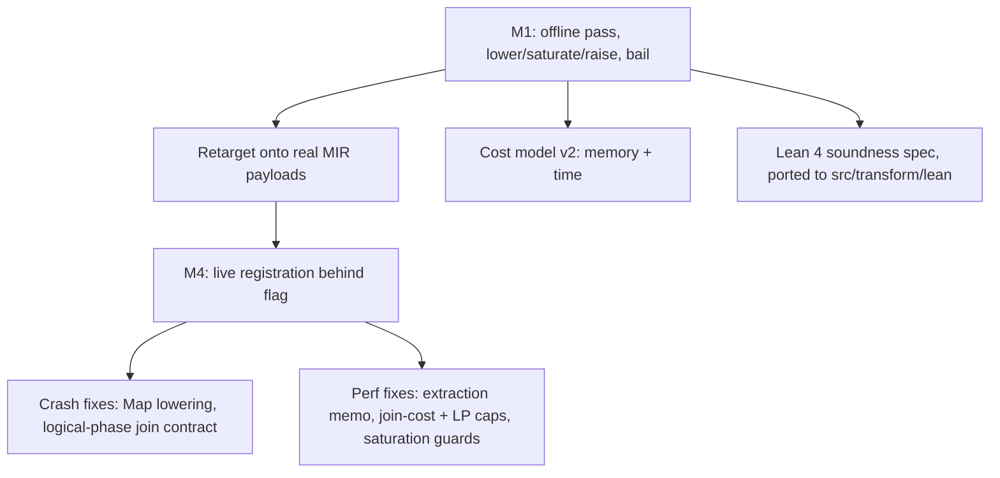

# MIR equality-saturation optimizer: project status

As of 2026-06-19, branch `claude/mir-equality-optimizer-sodbej`.
This is the single source of truth for where the effort stands; the design, roadmap, and scope-expansion plan in this directory hold the detail.

## What this is

An e-graph / equality-saturation optimizer for a subset of `MirRelationExpr`, wired into Materialize as the module `mz_transform::eqsat` (`src/transform/src/eqsat/`).
It lowers real MIR to a thin `Rel` tree carrying real scalar payloads, saturates a rule engine driven by a worst-case-optimal-join matcher, extracts the cheapest plan under a memory-and-time cost model, and raises back, bailing unsupported subtrees to opaque leaves.
The pass is registered in `Optimizer::logical_optimizer` behind the `enable_eqsat_optimizer` feature flag, which is **temporarily defaulted on** so CI exercises it across the test corpus (a TODO in `definitions.rs` tracks reverting it to `false` before the work leaves draft).
The engine began life as the standalone prototype `misc/mir-rewrite-dsl/`; that workspace is now deleted, its Rust ported into `mz_transform::eqsat` and its Lean 4 soundness spec into `src/transform/lean/`.

## Status at a glance

* Engine lives in `mz_transform::eqsat`; the old offline `src/transform-egraph` crate is gone.
* Registered live in `logical_optimizer` behind `enable_eqsat_optimizer` (default on, temporary).
* 33 active rewrite rules, 0 disabled.
* `Reduce` and `TopK` lower structurally; the bail set is `Constant`, global `Get`, `FlatMap`, `ArrangeBy`, `LetRec`.
* The live logical pass does structural rewrites only and leaves every join `Unimplemented`; the `WcoJoin`-to-`DeltaQuery` decision is committed only on the offline `optimize` path (see findings).
* Lean 4 spec ported to `src/transform/lean/`: 33 theorems, 13 proved, 20 `sorry` (column-structure, n-ary list laws, and empty-oracle obligations). Regenerate with `cargo run -p mz-transform --example gen-lean`.
* Differential harness `compare_real.rs`: harness registered for the first time as a Cargo test target in this task (Cargo.toml `[[test]]` entries added); prior counts (3w/4l/13t) were from before the Equivalences analysis was wired; the harness now hangs on case 5 (`filter_over_union_with_branch_filters`) due to non-convergence of `run_analysis` for the `Equivalences` domain (see Key findings).
* **BLOCKER**: `run_analysis` for `Equivalences` does not terminate on union-of-filtered inputs; fix needed before this can be measured.

## What is done

* **Milestone 1**: structural lower/saturate/extract/raise with bail-to-opaque, the saturating engine, and `apply=eqsat` datadriven tests.
* **Retarget onto real MIR payloads**: `EScalar { expr, lit }` carries the real `MirScalarExpr`; `cols`/`is_col` are live, remap is `permute`; unsupported subtrees live verbatim in `Rel::Opaque`/`ENode::Opaque` (hash-consing dedups them); `LocalGet` carries its original node. The interner is gone.
* **Single condition evaluator**: the e-class evaluator in `egraph.rs` is the only one; the divergent matcher-path evaluator and its sole caller `GreedyOptimizer` are deleted.
* **Cost model v2**: two axes, memory primary (size-weighted by the degree of each arranged collection) and time secondary. A tradeoff `Recommendation` surfaces a faster-but-heavier alternative (logic in place, not yet reachable end to end).
* **M4 live integration**: the engine moved into `mz_transform::eqsat` to break the crate cycle, registered after the logical fixpoints and before the final `Typecheck`. `EqSatTransform` guards on arity: it optimizes a clone and adopts the result only if the arity matches, else `soft_panic_or_log!` and no-op.
* **Crash fixes** (CI was fully red with the flag on):
  * Map lowering folded each scalar against input-only column types, but a `Map` scalar `i` may reference columns `0..input_arity+i`; `escalars_in_map_context` now grows the fold context per scalar.
  * `ProjectionPushdown` (run right after the logical optimizer with `include_joins=true`) panics on any filled-in join implementation, and `delta_queries::plan` installs physical-phase structure. So the live logical pass must emit plain `Unimplemented` joins. Fix: split `optimize` (commits `WcoJoin`-to-`DeltaQuery`, offline) from `optimize_logical` (raises with `commit_wcoj=false`); `EqSatTransform` calls `optimize_logical`.
* **Perf fixes** (a catalog-index optimization took 27s in `EqSatTransform`): the bottleneck was extraction, not saturation. Memoize extraction cost by built `Rel` (cost is compositional, so this is exact); cap exact join-subset costing at `MAX_EXACT_JOIN_INPUTS=8` with a left-deep estimate above it; cap `solve_cover_lp` vertex enumeration at `MAX_LP_VERTICES`. Plus saturation guards: `MAX_ENODES`, per-rule `MATCH_LIMIT` with exponential backoff, and an `EqSatTransform` `MAX_PLAN_SIZE` gate. Result: 27s to zero slow-optimization warnings.
* **Lean 4 spec ported**: emitter at `src/transform/src/eqsat/lean.rs`, proofs at `src/transform/lean/`, generator example `gen-lean`. The emitter is exhaustive over the live rule AST; generation is deterministic.

## Key findings

* **The live pass is parity, not improvement, by design.** Every active rule is one Materialize already implements, and the live pass changes no join selection. The harness wins are cost-model artifacts (eqsat omits a canonicalizing `Project`); prior counts (3w/4l/13t, pre-workstream-A) are documented but not re-confirmed because the harness now hangs. The losses were structural: eqsat extracting `n=2` (a residual Filter) while the real optimizer reaches `n=1` (empty/constant). Those are empty-propagation gaps, not scalar-folding failures.
* **BLOCKER: `run_analysis` for the `Equivalences` analysis does not terminate.** Case 5 (`filter_over_union_with_branch_filters`) hangs the test binary at 100% CPU indefinitely. The `run_analysis` fixpoint loop in `egraph.rs` drives the `Equivalences::make`/`merge` transfer function; the `merge` calls `EquivalenceClasses::minimize`, which is itself a fixpoint, and the two nested fixpoints may not jointly converge on plans with Union and Filter combinations. The `EquivalenceClasses` domain is not finite (it ranges over arbitrary `MirScalarExpr`), so the standard lattice termination argument does not apply directly. Root cause and fix are deferred; the analysis should be guarded (e.g. bounded iteration count, or a height-limited approximation) before the harness can produce results.
* **The genuine divergence is the cost-model decision on cyclic joins, and it is offline-only.** On the triangle join with no pre-existing indexes the e-graph proves `WcoJoin` dominates the binary `Join` on both axes: memory `[1.0,1.0,1.0]` versus `[2.0]` and time `[1.5]` versus `[2.0,1.5]`. `JoinImplementation` picks the dominated binary plan with `enable_eager_delta_joins` off and on, because it weighs arrangement-setup count and cannot see the `N^2` blowup with statistics disabled. `raise` can tag a `WcoJoin` as `JoinImplementation::DeltaQuery` (via `plan_as_delta_query`, reusing `delta_queries::plan`), and that tag survives because `JoinImplementation::action` only replans `Unimplemented`/`Differential`. But this commit is physical-phase structure, so it only runs on the offline `optimize` path; the live logical pass cannot ship it.
* **Logical versus physical with e-graphs.** `WcoJoin`/delta is inherently physical: it needs available-arrangement and index facts that exist only in physical optimization, and our cost model is currently index-blind (empty available arrangements). The right structure is two eqsat placements: a logical one for structural rewrites (joins `Unimplemented`, the current state) and a physical one after `JoinImplementation` (fed real arrangements, with `Rel::Join` carrying its implementation through lower/raise). E-graphs in principle dissolve the logical/physical split (one saturation, one global cost, extract the optimum), but Materialize's staged pipeline reasserts the boundary through information availability, physical-operator representation, and pipeline contracts such as `ProjectionPushdown` forbidding filled joins. Realizing the unified vision means replacing a contiguous pipeline segment with one saturation, not inserting eqsat between staged passes.

## Coverage: which pipeline transforms eqsat subsumes

The goal is to subsume the optimizer pipeline (`logical_optimizer` + `physical_optimizer` + `logical_cleanup_pass`) with equality saturation.
This is where each transform stands today.

**Covered** (a live rule performs the same rewrite):

| Transform | Mechanism |
| --- | --- |
| `Fusion` (filter/project/map/union) | `merge_filters`, `fuse_projects`, `fuse_maps`, `flatten_union(_nary)` |
| `compound::UnionNegateFusion` | `distribute_negate_union(_nary)`, `negate_negate` |
| `UnionBranchCancellation` | `union_cancel` plus the empty-drop rules |
| `ThresholdElision` | `threshold_elision` (uses the `non_negative` analysis) |
| `ReduceElision` | `reduce_elision` (uses the `is_unique_key` analysis) |
| `FoldConstants` | empty-propagation rules, the nullability lit-flag, and lower-time `MirScalarExpr::reduce` on every scalar payload |
| `ReduceScalars` | lower-time `MirScalarExpr::reduce` on Filter, Map, Join-equivalence, Reduce-key/aggregate, and TopK-limit payloads |
| `CoalesceCase` | subsumed by lower-time `reduce` (CASE coalescing) |
| `CaseLiteralTransform` | subsumed by lower-time `reduce` (literal CASE rewriting) |

**Partial** (movement covered, value inference not):

| Transform | Gap |
| --- | --- |
| `EquivalencePropagation` | the `Equivalences` e-class analysis drives scalar-payload canonicalization (reducer substitution) and unsatisfiable-to-empty collapse; redundant equality-predicate drop is deferred because it needs nullability facts unavailable at saturation time (see note below) |
| `PredicatePushdown` | `push_filter_*` move predicates, but no equivalence-derived predicate synthesis |
| `fusion::join::Join` | `flatten_join_first` only, first input, no join commutativity in the e-graph |
| `JoinImplementation` | `join_to_wcoj` to `DeltaQuery` is offline only; the live pass leaves joins `Unimplemented`; cost is index-blind |
| `ProjectionExtraction` / `ProjectionLifting` | only `map_columns_to_projection`; no demand-driven lifting |

**Missing**, in two clusters:

* **Scalar layer**: `LiteralLifting`, `LiteralConstraints`, and `CanonicalizeMfp` (there is no MFP node).
* **Analysis-propagation**: `Demand` and `ProjectionPushdown` (no column-liveness analysis), `NonNullRequirements`, `RedundantJoin`, `SemijoinIdempotence`, `ReductionPushdown`, `ReduceReduction`, `WillDistinct`. Plus `RelationCSE` (the graph shares internally, but raise emits a tree with no `Let`) and `FlatMapElimination` (`FlatMap` is bailed to opaque).

**Irreducible** (not equality rewrites; eqsat may decide them, but something must still lower): `Typecheck` and `CollectNotices` (validation and diagnostics), the `MonotonicFlag` annotation, the final MFP canonicalization the renderer demands, and `NormalizeLets` hygiene.

## Roadmap: one saturation in place of the pipeline

The end-state is not "no pipeline" but a pipeline reduced to `{bookkeeping} + {one saturate-and-extract} + {lowering}`.
The path is strangler-fig: grow eqsat to subsume one cluster of passes, prove the eqsat-only output is equal-or-better on the SLT corpus, delete those passes, repeat.
Five workstreams supply the capabilities; four deletion phases retire the pipeline.

**Workstreams** (capabilities):

* **(partial) A. E-class analyses.** Re-express Materialize's `analysis::{Equivalences, UniqueKeys, NonNegative, ColumnNames, Arity, Types}` and a column-liveness/demand lattice as egg-style e-class analyses that merge to a fixpoint during saturation. We already carry `non_negative`, keys, nullability, and monotonic. The `Equivalences` analysis is now wired (workstream A): it drives scalar-payload canonicalization via the `reducer()` substitution step and collapses unsatisfiable relations to empty. Demand remains the next high-value addition; it and the demand-driven projection cluster unlock the full analysis-propagation deletion phase.
* **(done) B. Scalar canonicalization.** De-opaqued the payloads pragmatically by running `MirScalarExpr::reduce` on payloads at lower time, reusing battle-tested scalar code (the same way the lit-flag is already computed). This buys constant folding, `CoalesceCase`, and `CaseLiteral` without a scalar e-graph. A full scalar e-graph is deferred until a rewrite needs cross-operator scalar saturation.
* **C. MFP coalescing.** At raise time, fold adjacent Map/Filter/Project into `mz_expr::MapFilterProject`, subsuming `CanonicalizeMfp` and part of `LiteralLifting`.
* **D. Index-aware cost and join carry-through.** Make the cost model consume arrangement and index availability (today empty), and make `Rel::Join` carry and restore its implementation through lower/raise (today wiped to `Unimplemented`). This is the only way to subsume `JoinImplementation` and the real home of the `WcoJoin` win. Inherently physical.
* **E. CSE, Let, and remaining variants.** Make extraction emit `Let` for e-classes referenced more than once in the DAG (subsuming `RelationCSE` and `NormalizeLets`), lower `Let`/`LetRec` structurally instead of bailing, and de-opaque `FlatMap`/`ArrangeBy`/`Constant`/`TopK`.

**Deletion phases** (each gated on SLT parity-or-better with the flag on):

1. **Logical fixpoints.** Land A (equivalences, demand, keys) plus B. eqsat then subsumes Fusion, PredicatePushdown, EquivalencePropagation, Demand/ProjectionPushdown, RedundantJoin, SemijoinIdempotence, the Reduce family, LiteralLifting, and FoldConstants. Delete `fixpoint_logical_01`, `fixpoint_logical_02`, and `fuse_and_collapse`. This is the first real pipeline removal.
2. **Logical cleanup.** Land C plus E. Delete the `logical_cleanup_pass` clusters (CanonicalizeMfp, RelationCSE, FlatMapElimination, NormalizeLets).
3. **Physical.** Land D as a second eqsat placement after equivalences and indexes are known. Delete `fixpoint_physical_01`, `JoinImplementation`, and LiteralConstraints, leaving only irreducible lowering.
4. **Unify (optional).** Collapse the two placements into one saturation only if index availability can be exposed as an analysis to a single graph; otherwise two placements is the honest steady-state.

**A concrete payoff: index selection as e-matching modulo equivalence.**
Today index use is brittle because it matches the lookup key against an indexed key syntactically.
An index on `#0 + 5` goes unused if the plan computed `5 + #0`, and an index on an `int8` column goes unused when type widening leaves the lookup key as `numeric` (or the reverse).
In an e-graph the available index keys are anchored as e-nodes and saturated under the same scalar equality rules as the lookup key (arithmetic commutativity and associativity, sound cast laws, constant folding), so the index is usable precisely when the lookup key and some index key share an e-class, with any guard emitted as a residual filter.
This decouples the form that is written from the forms that are equal, which is exactly what syntactic matching cannot do.
Representation types (`ReprScalarType`, `doc/developer/design/20240522_mir_representation_types.md`) already absorbed the cast class that is a representation no-op, since matching now reasons over the underlying representation and ignores SQL-level modifiers, so `varchar(n)` against `text` or `numeric(p,s)` against `numeric` already match.
The residual the e-graph targets is therefore narrower but real: representation-changing injective casts such as `Int64` to `Numeric`, and expression-form equivalence such as `#0 + 5` against `5 + #0`, neither of which repr types address.
It sits at the intersection of workstream B (scalar equivalences) and workstream D (index-aware cost) and wants both in a single saturation, so it is the strongest concrete argument for the unified placement in phase 4; the pragmatic payload-canonicalization in B2 is not enough, because cast and arithmetic equivalences must be real e-graph rules for the two keys to converge.
The soundness constraint is real: equality lookups require an injective, total cast, so widening `int8` to `numeric` is reversible with an in-range guard while narrowing is not, and each admissible law is a Lean obligation (injectivity suffices, since arrangements are hash-keyed on equality and need no monotonicity).

**The central bet, and the risks.**
Pass *order* in today's pipeline silently encodes heuristic policy (push predicates before planning joins).
eqsat replaces ordering with a single global cost function, so the cost model becomes the optimizer's entire objective; if it is wrong, eqsat will confidently extract worse plans.
Because statistics are disabled (cost is cardinality-free), the hardest decisions such as join order stay heuristic regardless of eqsat, so that ceiling is orthogonal to this work.
Two hard risks to budget for: saturation cost and termination on production plans of hundreds to thousands of nodes (the reason staged pipelines exist is bounded cost), and keeping extraction deterministic so SLT output is stable.

## What is left (near-term, tracked)

* Revert `enable_eqsat_optimizer` to `false` before the work leaves draft (TODO in `definitions.rs`).
* Incremental compositional cost in extraction (compute each node's `Cost` from its children's cached `Cost`, avoiding whole-subtree rebuilds), and `Id`-indexed dense storage (also a prerequisite for any SIMD extraction).
* Replace the ad-hoc termination guards with a payload-growth detector.
* Exercise the cost-model `Recommendation` end to end (it is unit-tested only).
* Discharge the 20 `sorry` Lean obligations (column-structure and n-ary list laws are provable; the empty-oracle ones need the `is_rel_empty` fact modeled).
* Add a Lean obligation for the lower-time reduction soundness condition. The condition is per-rule semantic identity, not a blanket no-relaxation rule: most rules keep a scalar in an equal-or-stricter context, and the one rule that moves it from a stricter to a looser context (filter pushdown into a join input) stays sound because the join equivalence enforces the strengthened non-null fact on every surviving row, mirroring the production `predicate_pushdown`. Encode the per-rule identity so a future rule that moves a scalar without preserving its evaluated semantics is forced to discharge the obligation.
* **BLOCKER: Fix `run_analysis` non-termination for `Equivalences`.** Guard the analysis with a bounded iteration count in `run_analysis`, or approximate the domain to a finite height (e.g. limit the number of equivalence classes per e-class). Until fixed, the differential harness hangs and the live flag should not be left on in CI.
* **Lean obligations for the `Equivalences` consumers** (add to `src/transform/lean/`): (a) the scalar-payload canonicalization consumer preserves the multiplicity denotation because the substituted representative is row-equal to the original scalar under the e-class equivalences; (b) `unsatisfiable => Empty` is sound because contradictory equivalences imply no row can satisfy all predicates simultaneously.
* **Redundant equality-predicate drop is deferred to the typed/physical phase (workstream D).** A `Filter[#a = #b]` over a relation that derives `{#a, #b}` as an e-class equivalence looks redundant, but the analysis derives the same equivalence from both null-rejecting sources (joins on `#a = #b`) and null-preserving sources (`Map[#1 := #0]`). Dropping the filter is only sound when the column is non-nullable, because `NULL = NULL` evaluates to NULL and the filter rejects the row. Column types are unavailable at saturation time, so the drop cannot be done soundly here. The right home is workstream D, where nullability facts are present. Do not re-attempt this in the saturation phase.

## How to run

* Unit tests: `cargo test -p mz-transform eqsat`.
* WCOJ and live-contract tests: `cargo test -p mz-transform --test wcoj_decision`.
* Datadriven: `cargo test -p mz-transform --test test_transforms` (the `eqsat.spec` cases).
* Differential harness: `cargo test -p mz-transform --test compare_real -- --nocapture`.
* Regenerate the Lean spec: `cargo run -p mz-transform --example gen-lean`.

## Branch

`claude/mir-equality-optimizer-sodbej`, base `upstream/main`, unmerged.
Carries this effort's design, plan, roadmap, the live `mz_transform::eqsat` implementation, the Lean spec under `src/transform/lean/`, and this status doc.
