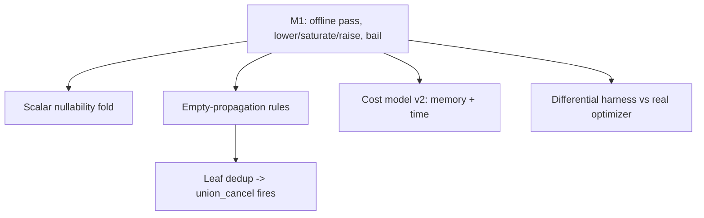

# MIR equality-saturation optimizer: project status

As of 2026-06-19, branch `claude/mir-equality-optimizer-sodbej`.
This is the single source of truth for where the effort stands; the design, roadmap, and scope-expansion plan in this directory hold the detail.

## What this is

An e-graph / equality-saturation optimizer for a subset of `MirRelationExpr`, wired into Materialize as the offline, test-only crate `src/transform-egraph` (`mz-transform-egraph`).
It lowers real MIR to a prototype `Rel`, saturates a ported rule engine, extracts the cheapest plan under an abstract cost model, and raises back, bailing unsupported subtrees to opaque leaves.
The crate is not registered in the live optimizer; it runs from the transform test harness via `apply pipeline=eqsat` and from a differential harness that compares it against the real optimizer.
The pre-existing prototype lives in its own workspace at `misc/mir-rewrite-dsl/` (DSL rules, e-graph, AGM cost, Lean proofs).

## Status at a glance

* `src/transform-egraph/src`, 57 tests passing.
* 33 active rewrite rules, 0 disabled (pushdown rules re-enabled via real `permute`; added `topk_empty`, `distribute_negate_join`, `factor_negate_join`).
* `Reduce` and `TopK` lower structurally; the bail set is now `Constant`, global `Get`, `FlatMap`, `ArrangeBy`, `LetRec`.
* The `WcoJoin` decision now survives to execution: raise tags the join `JoinImplementation::DeltaQuery` (synthesized by reusing the real `delta_queries::plan` via the new `mz_transform::join_implementation::plan_as_delta_query`), which `JoinImplementation` leaves unre-planned.
* Differential harness `compare_real.rs`: 3 wins (cost-model artifacts), 4 losses, 13 ties over 20 cases.
* The e-graph now carries real `MirScalarExpr`/`AggregateExpr`/`MirRelationExpr` payloads; the opaque `Scalar` type and the whole interner are gone.
* A single condition evaluator (the e-class one); the divergent matcher-path evaluator and its only caller `GreedyOptimizer` are deleted.
* All work reviewed; soundness gates passed including a final whole-branch review and per-increment reviews.

## What is done

* **Milestone 1**: lower (`Get`/`Project`/`Map`/`Filter`/`Join`/`Negate`/`Threshold`/`Union`/`Let` structural; `Constant`/global `Get`/`FlatMap`/`Reduce`/`TopK`/`ArrangeBy`/`LetRec` bailed to opaque leaves), interner for opaque scalars and bailed subtrees, exact round-trip raise, `optimize` reusing the saturating engine, `EqSatTransform` + `apply=EqSat` datadriven tests. A reachable panic on synthesized `Empty` constants was found in final review and fixed.
* **Scalar nullability fold**: predicates are folded against the input's column types to set the `lit` flag, so `IS NULL` on a `NOT NULL` column reads as false and `empty_false_filter` fires. Faithful: only the flag changes, the original scalar round-trips. Closed 7 of the harness losses.
* **Empty-propagation**: `Threshold`/`Negate`/`Filter`/`Union` collapse on an empty input, via an `is_rel_empty` side condition (no grammar change). Three termination guards were needed and are sound.
* **Leaf dedup**: identical bailed subtrees share one e-class, so `union_cancel` fires and produces the `Empty` the propagation rules consume. Closed 2 more losses.
* **Cost model v2**: two axes, memory primary (the scarce resource) and time secondary, with memory size-weighted (the degree of each arranged collection, not a flat count). A tradeoff `Recommendation` surfaces a faster-but-heavier alternative (logic in place, not yet reachable end to end).
* **Differential harness + experiments**: `compare_real.rs` (eqsat vs the real `logical_optimizer`) and `wcoj_decision.rs` (the AGM-vs-`JoinImplementation` experiment).
* **Retarget onto real MIR payloads** (after the design review): `EScalar { expr, lit }` carries the real `MirScalarExpr`; `cols`/`is_col` are live, remap is `permute`; unsupported subtrees live verbatim in `Rel::Opaque`/`ENode::Opaque` (hash-consing dedups them); `LocalGet` carries its original node. `interner.rs` deleted; lower/raise no longer thread an interner. This resolves design-review bug #2 (the unsound id/text remap) by construction.
* **Single condition evaluator**: `GreedyOptimizer` (an unused foil) and the dead matcher-path evaluator it alone used are deleted, resolving design-review bug #1 (two evaluators that could disagree on recursive `LocalGet` facts). The e-class evaluator in `egraph.rs` is the only one.

## Key findings

* **M1 is parity, not improvement, by design.** Every active rule is one Materialize already implements, confirmed empirically (eqsat and `predicate_pushdown` produce identical plans). The harness wins are cost-model artifacts (eqsat omits a canonicalizing `Project`), and the losses traced to missing scalar folding, now mostly closed.
* **The genuine divergence is the cost-model decision on cyclic joins.** On the triangle join with no pre-existing indexes the e-graph proves `WcoJoin` dominates the binary `Join` on both axes: memory `[1.0,1.0,1.0]` versus `[2.0]` and time `[1.5]` versus `[2.0,1.5]`. The size-weighted memory model exposes the `N^2` intermediate as the real memory cost. Materialize's `JoinImplementation` picks the dominated binary plan with `enable_eager_delta_joins` both off and on, because it weighs arrangement setup count and cannot see the `N^2` blowup with statistics disabled. This is the defensible win.
* **That decision now reaches execution (resolved).** `raise` tags a `WcoJoin` extraction as `JoinImplementation::DeltaQuery`, synthesized by reusing the real planner (`plan_as_delta_query` wraps `delta_queries::plan` with empty arrangement/stats context; keys come from the equivalences, so the plan is correct if not stats-optimal). Because `JoinImplementation::action` only (re)plans `Unimplemented`/`Differential` joins, the tag survives the downstream pipeline. Tests confirm the triangle raises to `DeltaQuery` and survives a `JoinImplementation` run. The remaining gap is purely live registration (M4): the pass is still offline, so this win is demonstrated, not yet shipped.

## What is left (tracked, not done)

* **Exercise the recommendation end to end**: add a rule that yields a faster-but-memory-heavier alternative so `Outcome.recommendation` fires on real input (it is unit-tested only).
* **Scope coverage**: `Reduce` and `TopK` now lower structurally; still bailed are `FlatMap`/`ArrangeBy` (and `Constant`/global `Get`/`LetRec`). `project_empty` and n-ary union empty-drop would close the last harness losses. (The 3 pushdown rules are re-enabled; under the cardinality-free cost model they are cost-neutral and only `push_filter_past_project`'s pushed form is selected, so they change extracted output only once a cardinality-aware cost model or an enabled downstream simplification rewards pushing down.)
* **Robustness before any production use**: replace the ad-hoc termination guards with a payload-growth detector; a full scalar-rewriting e-graph (M2b) for the `sorry` Lean rules.
* **Live integration (M4)**: register `EqSatTransform` behind a feature flag, plumb `StatisticsOracle`, promote the arity `debug_assert` to a hard check.

## How to run

* Unit and integration tests: `cargo test -p mz-transform-egraph`.
* Datadriven: `cargo test -p mz-transform --test test_transforms` (the `eqsat.spec` cases).
* Differential harness: `cargo test -p mz-transform-egraph --test compare_real -- --nocapture`.
* Join experiment: `cargo test -p mz-transform-egraph --test wcoj_decision -- --nocapture`.

## Branch

`claude/mir-equality-optimizer-sodbej`, base `upstream/main`, unmerged.
Carries the pre-existing prototype plus this effort's design, plan, roadmap, the M1 implementation, the scope increments above, and this status doc.
